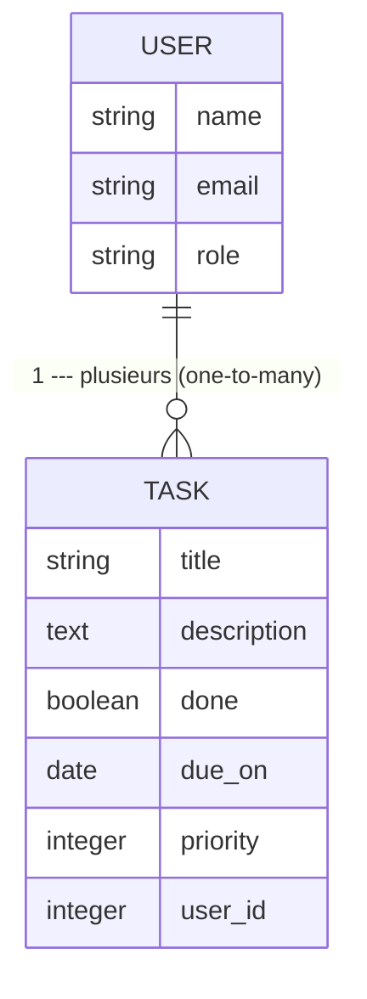

# Dossier de conception : [Le gestionnaire de tâches du Studio Lumière]

## 2.1 L'énoncé du problème (3 phrases) + la liste des 3 rôles

### L'énocé du problème

- **Qui a un problème :** L'équipe de studio lumière
- **Lequel :** Personne ne sait qui fait quoi et les urgences, gérer les
  tâches de l'équipe sur des post-its .
- **Ce qui se passe si on ne résout pas :** Les oublies (préparer les cabines, commander le gel, rappeler le cleint)

  **L'équipe du studio lumière gére les tâches de l'équipe sur des post-its, personne ne sait qui fait quoi et les urgences. Ces problèmes entrainent Les oublies (préparer les cabines, commander le gel, rappeler le cleint)**

### La liste des 3 roles

- **La gérante :** Crée et assigne les tâches, veut une vue d'ensemble
- **L'esthéticienne :** Voit SES tâches du jour, les coche
- **La réceptionniste :** Crée des tâches à la volée entre deux clientes

## Ex. 2.2 — Les 3 fiches de rôle complètes (qui / son problème / notre réponse / son workflow numéroté)

### La gérante

- **Qui :** La gérante
- **Son problème :** Elle ne sait pas ce qui est fait et ce qui est en retard
- **Notre réponse :** Une vue d'ensemble des tâches par personne et par urgence
- **Son workflow :** Elle ouvre l'appli → voit les tâches en retard en premier → crée une tâche → l'assigne → est notifiée quand c'est fait

### L'esthéticienne

- **Qui :** L'esthéticienne
- **Son problème :** Elle ne sait pas ce qu'elle doit faire et ce qui est urgent
- **Notre réponse :** Voit ses tâches du jour
- **Son workflow :** Elle ouvre l'appli → voit ses tâches par ordre d'urgence → traite la tâche (démarrer, en cours, terminer) → coche la tâche quand c'est terminer

### La réceptionniste

- **Qui :** La réceptionniste
- **Son problème :** Elle ne sait pas toujours à qui assigner la tâche ni si elle a été réalisée.
- **Notre réponse :** Elle crée les tâches
- **Son workflow :** Elle ouvre l'appli → Elle crée rapidement une tâche. → Elle ajoute les détails et le niveau d’urgence. → l'assigne → Elle suit son état : à faire, en cours ou terminée.→ est notifiée quand c'est fait

## Ex. 2.3 — Les wireframes papier des 3 écrans

## Ex. 2.4 — Le schéma de données

"La gérante crée et assigne les tâches à une esthéticienne. Une tache a un titre, une déscription, fait/non fait, une priorité, et une échéance"

- **Entitée :** Utilisateur, Tâche
- **Attribut de tâche :** titre, déscription, priorité, échéance, assigné à , fait
- **Attribut de l'utilisateur :** nom, email, role(gérante, esthéticienne, réceptionniste)
- **Relations :** une gérante crée DES tâches, une tâche appartient à une personne (relation one to many)

ce que je ne construis pas maintenant c'est le commentaire parce que les utilisateurs ici sont la gérantte, l'esthéticienne, et la réceptionniste donc il n'est pas possible pour un client de donner un commentaire sur les soins qu'il a reçu ou si la réceptionniste a vite pris sa tâche.

## 2.5 — La première critique

Les limites de ce document

- **Une même tâche peut être assigné à deux personnes** A traiter en priorité parce que une tâche doit appartenir à une seule personne

- **Une tâche sans échéance est possible** acceptable pour l'instant parce que chaque tâche a une priorité
